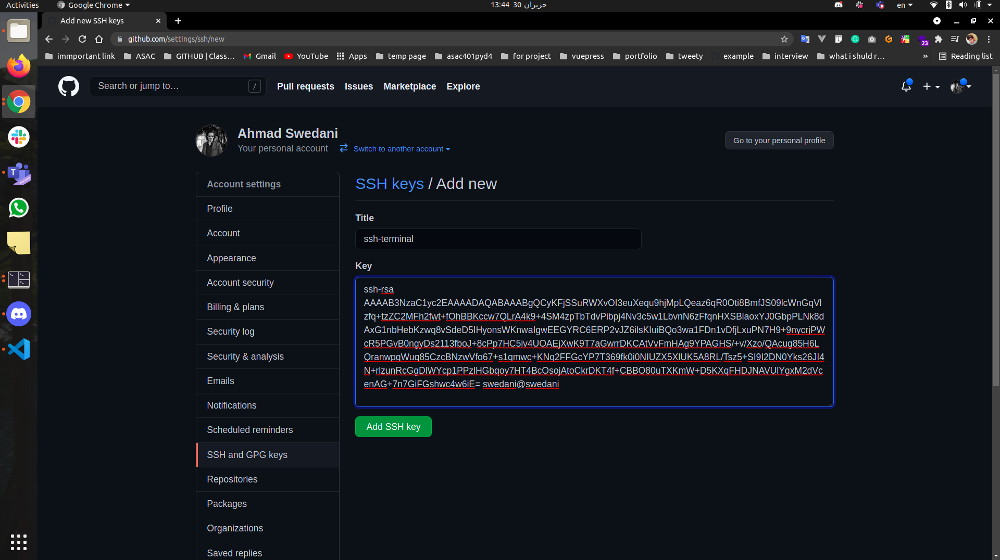
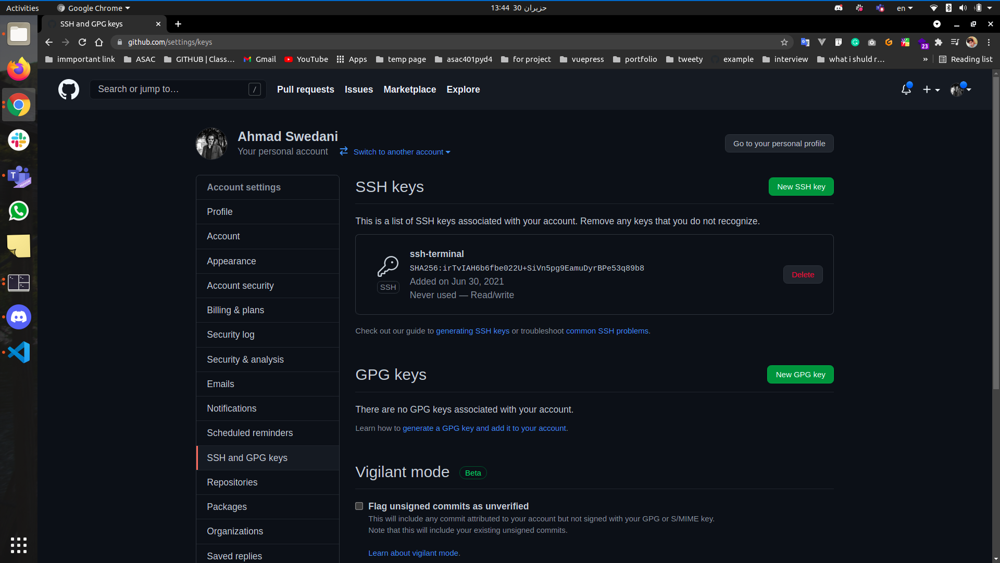
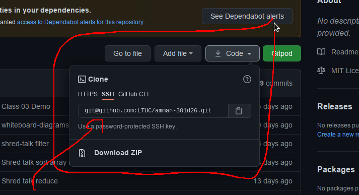

# Class01

**Comparing Graphical User Interface (GUI) and Command Line Interface (CLI):**


The operating system enables the interaction between the user and the device. It does this by providing two user interfaces: a command-line interface (CLI) and a graphical user interface (GUI).
- What is GUI?

A graphical user interface (GUI) is a visual representation of communication that makes it easy for users to interact with electronic devices.
- What is CLI?

Command-line interface (CLI) is a command-line program that relies on text inputs to perform operating system functions.

**The differences between GUI and CLI :**
- GUI is easier to learn and use. This is because of its user-friendly interface. 

- CLI offers a great environment for multitasking. While in a GUI environment, the ability to perform multiple tasks at once on one screen is not as efficient.

- Users of CLI need to master scripting syntax and commands. New users may find it difficult to create scripts.

- GUI provides the option to create scripts using programming software. With programming software, one can write scripts or develop other software without necessarily knowing all the syntax and commands. 

- GUI allows control over the operating system and files. But one still needs CLI to perform advanced tasks. This is because the command line interface provides total control over the operating system and files. Furthermore, tasks become simpler with CLI.

### basic  terminal commands  :

* `pwd`: (Print Working Directory)
  - It tells you what your current or present working directory is.
  - pwd takes no arguments.
  - Where we currently are.
* `ls`: (list)
   - `ls Documents`
   - List the contents of a directory.
   - `ls -a Documents`
* `cd`: (change directory)
   - It is used to change the current working directory.
   - If the directory name has spaces then it can be handled by `cd 'Holiday Photos'` or `cd Holiday\ Photos`
   - It is used to go to previous directory `cd ..`
* `mkdir` (Make Directory) - ie. Create a directory.
* `rmdir` (Remove Directory) - ie. Delete a directory.
* `touch` (Create a blank file).
* `cp` (Copy) - ie. Copy a file or directory.
* `mv` (Move) - ie. Move a file or directory (can also be used to rename).
* `rm` (Remove) - ie. Delete a file.
* `cat` View a file content.

###  What is  version control system (VCS) :

Version control systems are software tools that help software teams manage changes to source code over time. As development environments have accelerated, version control systems help software teams work faster and smarter.

### What is Git :

Git is the most commonly used version control system. Git tracks the changes you make to files, so you have a record of what has been done, and you can revert to specific versions whenever it is needed. Git also makes collaboration easier, allowing changes by multiple people to all be merged into one source. 

### Git Commands Cheat sheet:
` git config --global user.name "Jane Smith"`

`git config --global user.email "example@email.com" `

* `git config --list`
* `git init`
* `git add .`
* `git commit -m "commit- message"`
* `git push origin main`
* `git clone https://github.com/test`
* ` git status`

### What is Github :

GitHub is a for-profit company that offers a cloud-based Git repository hosting service. Essentially, it makes it a lot easier for individuals and teams to use Git for version control and collaboration.

### What is the difference between git and Github :

Git is a version control system that lets you manage and keep track of your source code history. GitHub is a cloud-based hosting service that lets you manage Git repositories. If you have open-source projects that use Git, then GitHub is designed to help in managing them better. 

### Markdown language / its features:

Markdown is a lightweight markup language that you can use to add formatting elements to plaintext text documents.
- some MD Basic Syntax : 

```
   Headers :
	   # Heading level 1
	   ## Heading level 2
	   ### Heading level 3
   Bold :  just love **bold text**.
   Italic: A*cat*meow
   blockquote :  >create a blockquote
   ordered list : 
	   1. First item
	   2. Second item
	   3. Third item
	   4. Fourth item
   unordered list : 
	   * First item
	   * Second item
	   * Third item
	   * Fourth item
   images :  
    URL   :    [EFF](https://eff.org)


```
### Cloning using SSH :
**Setup SSH keys:**

1. First open the terminal:

2. Create new SSH key using this command and press enter three times, and copy the key

	```bash
   cd && ssh-keygen && cat ~/.ssh/id_rsa.pub
   ```


## GitHub part
1. Open [GitHub setting Keys](https://github.com/settings/keys)

2. Click on New SSH key you will see this result:

3. Write ssh-terminal in the title section
4. Paste the key that we copied before in the Key section.

5. Click on Add SSH key you will see this result

**Important:** to change the remote from Https to SSH

 open your repo and run this command :

	```
   git remote set-url origin SSH-URL
   ```
