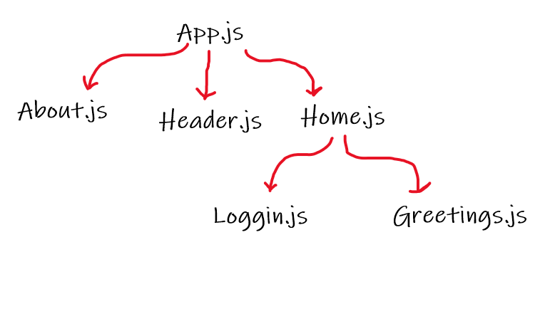

# Class17 Notes:

## Demo Steps:
* Components Tree:

*  **Routing Example**: use `About` and `Home` components for using React Router. Create links in the `Header` component to switch between them.
*  **useState Hook Example:** `isLoggedIn` state in `Home` component.
* **Handling Events Example**: `Loggin` component change the state `onClick`
* **Passing Props as Function Example**: passing `isLoggedIn` state to `Greetings` component to display a proper message.
* **Conditional Rendering Example**:
   - In `Loggin` Component: using if statement 
   - In `Greetings` Component: using Ternary Operators.
   - Another Example can be done using logic operators.

## React Routing:
* React Router is a routing library for React, a JavaScript library for building user interfaces. React Router runs anywhere React runs; on the web, on the server with node.js, and on React Native.
* React Router is compatible with React >= 16.8.

### Routing V6:
* `npm install react-router-dom@6`
* React Router version 6 introduces several powerful new features, as well as improved compatibility with the latest versions of React. It also introduces a few breaking changes from version 5.

## Conditional Rendering:
* Conditional rendering in React works the same way conditions work in JavaScript. 
* Use JavaScript operators like `if` or the `conditional operator` to create elements representing the current state, and let React update the UI to match them.